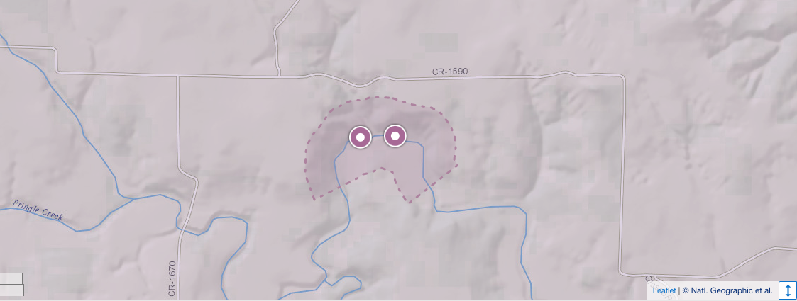

```{r setup, include=FALSE}
knitr::opts_chunk$set(echo = TRUE)
```

```{r load}
library(tidyverse)
library(lubridate)
```

This report demonstrates variety of processes used to transform raw data into more readily used formats.

## Study area 

- Pringle Creek, NEON (National Ecological Observatory Network) aquatic sites located in Wise County, Texas, USA

- NEON usually has two sensor locations on any river in the network where water quality is measured using in-situ sensors.

- In Pringle Creek, these locations are situated about 200 m apart.

```{r   out.width = "100%", echo = FALSE, fig.cap='', fig.align='center'}

```


```{r}
# This is a working script to remove wiper anomalies occurs at every 5th  observation
# load data (setwd to the source file location)

load(here::here("data", "data-raw", "flagged-data", "waq_down.rda"))
load(here::here("data", "data-raw", "flagged-data", "waq_up.rda"))
#load(here::here("data", "data-raw", "EOS_5_min.rda"))
#load(here::here("data", "data-raw", "TSW_5min.rda"))

waq_strm_cols <- c("specificConductance", "dissolvedOxygen", "pH", 
                   "turbidity", "chlorophyll", "fDOM")
waq_anomaly_flag <- c("conductanceAnomalyFlag", "dissolvedOxygenAnomalyFlag",
                      "pHAnomalyFlag", "turbidityAnomalyFlag", 
                      "chlorophyllAnomalyFlag", "fDOMAnomalyFlag")

waq_down <- waq_down %>% 
  filter(Timestamp >= ymd("2019-07-01") & Timestamp < ymd("2020-01-01"))
waq_up <- waq_up %>% 
  filter(Timestamp >= ymd("2019-07-01") & Timestamp < ymd("2020-01-01"))

waq_up <- waq_up %>% 
  mutate(turbidity = if_else(turbidityAnomalyFlag == 1, as.numeric(NA),
                             turbidity),
         specificConductance = if_else(conductanceAnomalyFlag == 1, 
                                       as.numeric(NA), specificConductance),
         pH = if_else(pHAnomalyFlag == 1, as.numeric(NA),
                      pH),
         dissolvedOxygen = if_else(dissolvedOxygenAnomalyFlag == 1, 
                                   as.numeric(NA), dissolvedOxygen),
         chlorophyll = if_else(chlorophyllAnomalyFlag == 1, 
                               as.numeric(NA), chlorophyll),
         fDOM = if_else(fDOMAnomalyFlag == 1, as.numeric(NA),
                        fDOM))

waq_down <- waq_down %>% 
  mutate(turbidity = if_else(turbidityAnomalyFlag == 1, as.numeric(NA),
                             turbidity),
         specificConductance = if_else(conductanceAnomalyFlag == 1, 
                                       as.numeric(NA), specificConductance),
         pH = if_else(pHAnomalyFlag == 1, as.numeric(NA),
                      pH),
         dissolvedOxygen = if_else(dissolvedOxygenAnomalyFlag == 1, 
                                   as.numeric(NA), dissolvedOxygen),
         chlorophyll = if_else(chlorophyllAnomalyFlag == 1, 
                               as.numeric(NA), chlorophyll),
         fDOM = if_else(fDOMAnomalyFlag == 1, as.numeric(NA),
                        fDOM))

```

```{r}

data_turb_up <- waq_up %>% 
  select(Timestamp, turbidity) %>% 
  mutate(turbidity_diff = turbidity - lag(turbidity, n = 1L),
         turbidity_max = zoo::rollmax(turbidity, k = 5, fill = NA,
                                      align = "right"),
         wiper_flag = if_else(turbidity == turbidity_max, 1, 0),
         wiper_flag = if_else(is.na(wiper_flag), 0, wiper_flag))

data_turb_down <- waq_down %>% 
  select(Timestamp, turbidity) %>% 
  mutate(turbidity_diff = turbidity - lag(turbidity, n = 1L),
         turbidity_max = zoo::rollmax(turbidity, k = 5, fill = NA,
                                      align = "right"),
         wiper_flag = if_else(turbidity == turbidity_max, 1, 0),
         wiper_flag = if_else(is.na(wiper_flag), 0, wiper_flag))

```


```{r}
## ---- timeplots-flagged-anomalies

waq_up_sub <- waq_up %>% 
  select(Timestamp, turbidity, turbidityAnomalyFlag, turbidity_wiperAnomalyFlag,
         specificConductance, conductanceAnomalyFlag, dissolvedOxygen,
         dissolvedOxygenAnomalyFlag) %>% 
  filter(Timestamp >= ymd("2019-10-01") & Timestamp < ymd("2020-01-01"))

waq_down_sub <- waq_down %>% 
  select(Timestamp, turbidity, turbidityAnomalyFlag, 
         turbidity_wiperAnomalyFlag) %>% 
  filter(Timestamp >= ymd("2019-10-01") & Timestamp < ymd("2020-01-01"))


## ---- wiper-anomaly

waq_down_sub %>% 
  filter(Timestamp >= ymd("2019-10-14") & Timestamp < ymd("2019-10-15")) %>% 
  mutate(wiper_anomaly_flag = factor(turbidity_wiperAnomalyFlag,
                                     levels = c(0,1), 
                                     labels = c("valid data", "wiper anomaly"))) %>% 
  ggplot(aes(Timestamp, turbidity, 
             color = wiper_anomaly_flag)) +
  geom_point() +
  ylab("Turbidity (FNU)") +
  scale_color_manual(values = c("black", "red"))

waq_up_sub %>% 
  filter(Timestamp >= ymd("2019-10-14") & Timestamp < ymd("2019-10-15")) %>% 
  mutate(wiper_anomaly_flag = factor(turbidity_wiperAnomalyFlag,
                                     levels = c(0,1), 
                                     labels = c("valid data", "wiper anomaly"))) %>% 
  ggplot(aes(Timestamp, turbidity, 
             color = wiper_anomaly_flag)) +
  geom_point() +
  scale_color_manual(values = c("black", "red"))


```


```{r}
load(here::here("data", "data-raw", "EOS_5_min.rda"))
load(here::here("data", "data-raw", "TSW_5min.rda"))

load(here::here("data", "data-raw", "waq_instantaneous.rda"))
load(here::here("data", "data-raw", "variables_20288.rda"))


```

# Summary of quality flags for NEON data

There are different types of quality tests carried out for NEON data. 

* **Range test** - checks whether every observation falls within reasonable minimum and maximum values for a given location and time of year.
* **Persistence test ** - checks for realistic fluctuation of values over a designated period of time. 
* **Stochastic test** - check to ensure that changes in a time series of data are realistic over a given period of time.
  - **Step test** - successive data points are compared to determine if their difference exceeds a maximum threshold.
  - **Null test** - the number of dropped data points over a given period is monitored.
  - **Gap test** - doesn't report null values but rather just have a ???jump??? in sample times.
* **Spike test**
* **Valid calibration test**
* **Suspect calibration test**
* **fDOMTempQF** - corrected for temporature 
* **fDOMAbsQF** - corrected for absorbance
* **alpha quality flags** 
  - 1 - If any of the above quality tests fails 
  - 0 - If all of the above quality tests pass
* **beta quality flags**
  - -1 - If any of the above quality tests could not run
  -  0 - If all of the above quality tests pass
  
* **Final Quality Flag**
  - 0 - If AlphaQF = 0
  - 1 - If AlphaQF = 1
  - -1 - If BetaQF = -1


# Different types of quality flags in Pringle Creek data

* Let us consider downstream turbidity during July-2019 to December-2019. 
* The data are measured in 1-minute time intervals. 

```{r}
### Turbidity downstream
waq_instantaneous <- waq_instantaneous %>% 
  mutate(Timestamp = ymd_hms(endDateTime))
  
waq_up <- waq_instantaneous %>%
  filter(horizontalPosition == "101")
waq_down <- waq_instantaneous %>%
  filter(horizontalPosition == "102")

waq_qf_names <- variables_20288 %>% 
  filter(str_detect(fieldName, pattern = "QF")) %>% 
  pull(fieldName)
turb_waq_qf_names <- str_subset(waq_qf_names, pattern = "turbidity")

data_turbidity_down <- waq_down %>% 
  filter(Timestamp >= ymd("2019-07-01") &
           Timestamp < ymd("2020-01-01")) %>% 
  select(Timestamp, turbidity, all_of(turb_waq_qf_names)) %>% 
  as_tibble()

data_turbidity_down <- data_turbidity_down %>% 
  select(Timestamp, turbidity, all_of(turb_waq_qf_names)) %>% 
  mutate(Flag = case_when(turbidityRangeQF == 1 ~ "Range Flag",
                          turbidityStepQF == 1 ~ "Step Flag",
                          turbidityNullQF == 1 ~ "Null Flag",
                          turbidityGapQF == 1 ~ "Gap Flag",
                          turbiditySpikeQF == 1 ~ "Spike Flag",
                          turbidityPersistenceQF == 1 
                          ~ "Persistence Flag",
                          turbidityValidCalQF == 1 
                          ~ "Valid Calibration",
                          turbiditySuspectCalQF == 1 
                          ~ "Suspect Calibration",
                          TRUE ~ "Valid data"))


data_turbidity_down %>% 
  ggplot(aes(Timestamp, turbidity, color = Flag, shape = Flag,
             size = Flag)) + 
  geom_point() +
  scale_color_manual(values = c("#999999", "#E69F00", "#56B4E9",
                                "#009E73", "#F0E442", "#0072B2",
                                "#D55E00", "#CC79A7", "#000000"),
                     breaks = c("Valid data", "Persistence Flag",
                                "Spike Flag", "Range Flag", 
                                "Null Flag", "Gap Flag", 
                                "Valid Calibration", "Step Flag",
                                "Suspect Calibration")) +
  scale_shape_manual(values = c(0, 1, 2, 3, 4, 8, 6, 5, 14), 
                     breaks = c("Valid data", "Persistence Flag",
                                "Spike Flag", "Range Flag", 
                                "Null Flag", "Gap Flag", 
                                "Valid Calibration", "Step Flag",
                                "Suspect Calibration")) +
  scale_size_manual(values = c(0.1,1.5,1.5,1.5,1.5,1.5,1.5,1.5,1.5), 
                    breaks = c("Valid data", "Persistence Flag",
                                "Spike Flag", "Range Flag", 
                                "Null Flag", "Gap Flag", 
                                "Valid Calibration", "Step Flag",
                                "Suspect Calibration")) +
  ggtitle("Pringle Creek Turbidity downstream location")


```

```{r}
### Turbidity upstream

```{r turbidity_up, echo=FALSE}

data_turbidity_up <- waq_up %>% 
  as_tibble() %>% 
  mutate(Timestamp = ymd_hms(endDateTime)) %>% 
  filter(Timestamp >= ymd("2019-07-01") 
         & Timestamp <= ymd("2020-01-01")) %>% 
  select(Timestamp, turbidity, all_of(turb_waq_qf_names)) %>% 
  mutate(Flag = case_when(turbidityRangeQF == 1 ~ "Range Flag",
                          turbidityStepQF == 1 ~ "Step Flag",
                          turbidityNullQF == 1 ~ "Null Flag",
                          turbidityGapQF == 1 ~ "Gap Flag",
                          turbiditySpikeQF == 1 ~ "Spike Flag",
                          turbidityPersistenceQF == 1 
                          ~ "Persistence Flag",
                          turbidityValidCalQF == 1 
                          ~ "Valid Calibration",
                          turbiditySuspectCalQF == 1 
                          ~ "Suspect Calibration",
                          TRUE ~ "Valid data"))

data_turbidity_up %>% 
  ggplot(aes(Timestamp, turbidity, color = Flag, shape = Flag,
             size = Flag)) +
  geom_point() +
  scale_color_manual(values = c("#999999", "#E69F00", "#56B4E9",
                                "#009E73", "#F0E442", "#0072B2",
                                "#D55E00", "#CC79A7", "#000000"),
                     breaks = c("Valid data", "Persistence Flag",
                                "Spike Flag", "Range Flag", 
                                "Null Flag", "Gap Flag", 
                                "Valid Calibration", "Step Flag",
                                "Suspect Calibration")) +
  scale_shape_manual(values = c(0, 1, 2, 3, 4, 8, 6, 5, 14), 
                     breaks = c("Valid data", "Persistence Flag",
                                "Spike Flag", "Range Flag", 
                                "Null Flag", "Gap Flag", 
                                "Valid Calibration", "Step Flag",
                                "Suspect Calibration")) +
  scale_size_manual(values = c(0.1,1.5,1.5,1.5,1.5,1.5,1.5,1.5,1.5), 
                    breaks = c("Valid data", "Persistence Flag",
                                "Spike Flag", "Range Flag", 
                                "Null Flag", "Gap Flag", 
                                "Valid Calibration", "Step Flag",
                                "Suspect Calibration")) + ggtitle("Pringle Creek Turbidity upstream location")

```


First let us remove the wiper anomalies from turbidity 

```{r eval = FALSE}

waq_down <- waq_down %>% 
  filter(Timestamp >= ymd("2019-07-01") & Timestamp < ymd("2020-01-01"))
waq_up <- waq_up %>% 
  filter(Timestamp >= ymd("2019-07-01") & Timestamp < ymd("2020-01-01"))


waq_down <- waq_down %>% 
  mutate(turbidity = if_else(turbidity_wiperAnomalyFlag == 1 &
                                 turbidityAnomalyFlag == 0,
                              as.numeric(NA), turbidity))
waq_up <- waq_up %>% 
  mutate(turbidity = if_else(turbidity_wiperAnomalyFlag == 1 &
                               turbidityAnomalyFlag == 0,
                             as.numeric(NA), turbidity))


```


- The water-quality variables measured by these in-situ sensors include turbidity, specific conductance $(\mu$ S/cm), pH, dissolved oxygen (mg/l) and chlorophyll (mg/l) from both upstream and downstream locations $\longleftarrow$ Measurements are available at **1-minute** frequencies 

- Surface water level (meters above see level) and water temperature (Celsius) from both locations. $\longleftarrow$ Measurements are available at **5-minute** frequencies.


- Aggregated data such that time stamps match across two different datasets

Now let's aggregate into 5mint intervals


```{r eval = FALSE}
#-- Aggregating upstream data 

waq_5min_up <- waq_up %>% 
  padr::thicken(interval = "5 min",
                by = "Timestamp",
                colname = "roundedTimestamp",
                rounding = "down") %>% 
  group_by(roundedTimestamp) %>% 
  summarise_at(vars(waq_strm_cols), mean, na.rm = TRUE)

waq_anomaly_flag_5min_up <- waq_up %>% 
  padr::thicken(interval = "5 min",
                by = "Timestamp",
                colname = "roundedTimestamp",
                rounding = "down") %>% 
  group_by(roundedTimestamp) %>% 
  summarise_at(vars(waq_anomaly_flag), max, na.rm = TRUE)

waq_5min_up <- waq_5min_up %>% 
  left_join(waq_anomaly_flag_5min_up, by = "roundedTimestamp")


#-- Agrregating downstream data --#

waq_5min_down <- waq_down %>% 
  padr::thicken(interval = "5 min",
                by = "Timestamp",
                colname = "roundedTimestamp",
                rounding = "down") %>% 
  group_by(roundedTimestamp) %>% 
  summarise_at(vars(waq_strm_cols), mean, na.rm = TRUE)

waq_anomaly_flag_5min_down <- waq_down %>% 
  padr::thicken(interval = "5 min",
                by = "Timestamp",
                colname = "roundedTimestamp",
                rounding = "down") %>% 
  group_by(roundedTimestamp) %>% 
  summarise_at(vars(waq_anomaly_flag), max, na.rm = TRUE)

waq_5min_down <- waq_5min_down %>% 
  left_join(waq_anomaly_flag_5min_down, by = "roundedTimestamp")


```


# Now let's aggregate into 5mint intervals

```{r eval = FALSE}

# Merging with level and temperature data

EOS_5min_up <- EOS_5_min %>% 
  as_tibble() %>% 
  mutate(Timestamp = ymd_hms(endDateTime)) %>% 
  filter(horizontalPosition == 110,
         Timestamp >= ymd("2019-07-01") 
                & Timestamp < ymd("2020-01-01")) %>% 
  select(Timestamp, surfacewaterElevMean)

EOS_5min_down <- EOS_5_min %>% 
  as_tibble() %>% 
  mutate(Timestamp = ymd_hms(endDateTime)) %>% 
  filter(horizontalPosition == 132,
         Timestamp >= ymd("2019-07-01") 
                & Timestamp < ymd("2020-01-01")) %>% 
  select(Timestamp, surfacewaterElevMean)


TSW_5min_up <- TSW_5min %>% 
  as_tibble() %>% 
  mutate(Timestamp = ymd_hms(endDateTime)) %>% 
  filter(horizontalPosition == 101,
         Timestamp >= ymd("2019-07-01") 
                & Timestamp < ymd("2020-01-01")) %>% 
  select(Timestamp, surfWaterTempMean)

TSW_5min_down <- TSW_5min %>% 
  as_tibble() %>% 
  mutate(Timestamp = ymd_hms(endDateTime)) %>% 
  filter(horizontalPosition == 102,
         Timestamp >= ymd("2019-07-01") 
                & Timestamp < ymd("2020-01-01")) %>% 
  select(Timestamp, surfWaterTempMean)


all_5min_up <- list(waq_5min_up, EOS_5min_up, TSW_5min_up) %>% 
  purrr::reduce(left_join, by = c("roundedTimestamp" = "Timestamp")) %>% 
  mutate(site = "up")

all_5min_down <- list(waq_5min_down, EOS_5min_down, TSW_5min_down) %>% 
  purrr::reduce(left_join, by = c("roundedTimestamp" = "Timestamp")) %>% 
  mutate(site = "down")


# Joining upstream and downstream together

PRIN_5min_flagged <- bind_rows(all_5min_up, all_5min_down)

save(PRIN_5min_flagged, file = "../data/PRIN_5min_flagged.rda")


```

Purpose: To evaluate the performance of our proposed algorithms


## Load data

```{r loadoutPRINData}
load(here::here( "data", "data-raw", "PRIN_5min_flagged.rda"))

PRIN_5min_flagged <- PRIN_5min_flagged %>%
  rename(
    Timestamp = roundedTimestamp,
    level = surfacewaterElevMean,
    conductance = specificConductance,
    dissolved_oxygen = dissolvedOxygen,
    temperature = surfWaterTempMean
  ) %>%
  mutate(Timestamp = ymd_hms(Timestamp))

```

## Visualization of data with outliers

```{r tsanomalyplotPRINData, fig.height=13, out.width="100%"}


# Pivot data values from wide to long
data_val <- PRIN_5min_flagged %>%
  select(Timestamp, conductance, dissolved_oxygen,
       pH, turbidity, chlorophyll, fDOM,
       level, temperature, site ) %>%
  #as_tsibble(index = Timestamp, key = site) %>%
  pivot_longer(cols = conductance:temperature) 

# Pivot data flags from wide to long
data_flag <- PRIN_5min_flagged %>%
  select(Timestamp, conductanceAnomalyFlag, 
         dissolvedOxygenAnomalyFlag,
         pHAnomalyFlag, turbidityAnomalyFlag,
         chlorophyllAnomalyFlag, fDOMAnomalyFlag,
         site ) %>%
  rename(
    conductance = conductanceAnomalyFlag,
    dissolved_oxygen = dissolvedOxygenAnomalyFlag,
    pH = pHAnomalyFlag,
    turbidity = turbidityAnomalyFlag,
    chlorophyll = chlorophyllAnomalyFlag,
    fDOM = fDOMAnomalyFlag
  ) %>%
  #as_tsibble(index = Timestamp, key = site) %>%
  pivot_longer(cols = conductance:fDOM)

# Combine values and flag data

data<- left_join(data_val, data_flag, by = 
                   c("Timestamp", "site", "name" ) ) %>%
      rename(value = value.x,
             flag = value.y)

data_outliers <- data %>%
  filter(flag == 1)
  

p <- data %>%
  ggplot(aes(x = Timestamp, y = value, color = site)) +
  geom_line() +
  facet_wrap(~name, ncol = 1, scales = "free_y") +
  scale_color_manual(values = c("down" = "black", "up" = "blue")) +
  theme(legend.position='bottom') +
  geom_point(data = data_outliers, aes(x = Timestamp, y = value), color = "red" )

print(p)
```


## Visualization of upstream data with outliers

```{r tsplotUPstream, out.width="100%", fig.height=8, fig.cap="Upstream data"}
data_outliers <- data %>%
  filter(flag == 1, site == "up")

p1 <- data %>%
  filter(site == "up") %>%
  ggplot(aes(x = Timestamp, y = value)) +
  geom_line() +
  facet_wrap(~name, ncol = 1, scales = "free_y") +
  theme(legend.position='bottom') +
  geom_point(data = data_outliers, aes(x = Timestamp, y = value), color = "red" )

print(p1)

```


## Visualization of downstream data with outliers


```{r tsplotDownstream, out.width="100%", fig.height=8, fig.cap="Downstream data"}

data_outliers <- data %>%
  filter(flag == 1, site == "down")

p2 <- data %>%
  filter(site == "down") %>%
  ggplot(aes(x = Timestamp, y = value)) +
  geom_line() +
  facet_wrap(~name, ncol = 1, scales = "free_y") +
  theme(legend.position='bottom') +
  geom_point(data = data_outliers, aes(x = Timestamp, y = value), color = "red" )

print(p2)

```
